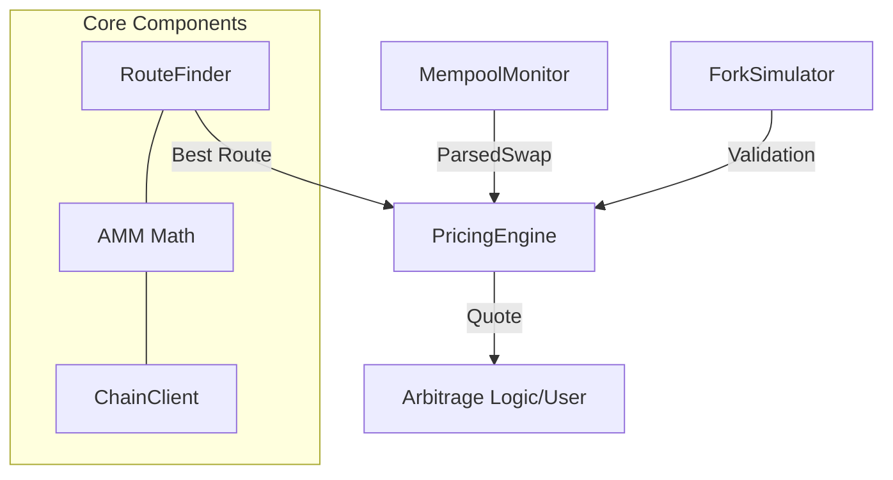

# Week 1: Arbit

This project serves as the foundation for an arbitrage trading system. It includes core modules for secure wallet management, robust blockchain interaction, transaction construction, and analysis.

## Project Structure


- **`core/`**: Base logic and types.
    - `wallet.py`: Secure private key management and signing.
    - `types.py`: Strongly typed `Address` and `TokenAmount` with validation.
    - `serializer.py`: Deterministic JSON serialization (canonical) for signing.
- **`chain/`**: Blockchain interaction.
    - `client.py`: RPC client with automatic retries, exponential backoff, and provider switching.
    - `builder.py`: Fluent API for constructing and signing transactions.
    - `analyzer.py`: Tool for dissecting and decoding transaction data.
- **`pricing/`**: Market analysis and simulation.
    - `amm.py`: Constant Product Market Maker (Uniswap V2) math and Price Impact analysis.
    - `routing.py`: Multi-hop route discovery and net-output optimization (including gas costs).
    - `mempool.py`: Real-time monitoring of pending swaps via WebSockets.
    - `simulation.py`: Transaction simulation using local Ethereum forks (Anvil).
    - `engine.py`: High-level orchestrator integrating routing, simulation, and monitoring.
- **`scripts/`**: Utility scripts and tools.
    - `analyze_impact.py`: CLI tool to visualize price impact for different trade sizes.
    - `integration_test.py`: End-to-end test on Sepolia network.
    - `start_fork.sh`: Script to launch a local Anvil fork for testing.
- **`tests/`**: Unit tests ensuring correctness of core components.
- **`src/`**: Source code (application logic).
- **`configs/`**: Configuration files.
- **`docs/`**: Documentation.
- **`Makefile`**: Entry point for build, test, and run commands.

## Prerequisites

- Python 3.10+
- GNU Make
- Git
- Anvil (part of Foundry) for local fork simulations.
 
## Installation & Setup

1. Clone the repository:
   - `git clone <repository_url>`
   - `cd trading-bot`

2. Create and activate a virtual environment:
   - `python3 -m venv .venv`
   - `source .venv/bin/activate`

3. Install dependencies:
   - `make install`

4. Install pre-commit hooks (required for development):
   - `pre-commit install`

## Configuration (Secrets Management)

1. Create a local environment file based on the template:
   - `cp .env.example .env`

2. Open .env and populate the variables:
   - ENV_TYPE=local
   - PRIVATE_KEY=<your_private_key>
   - SEPOLIA_RPC_URL=https://ethereum-sepolia-rpc.publicnode.com
   - ALCHEMY_RPC_URL=https://eth-sepolia.g.alchemy.com/v2/ВАШ_КЛЮЧ_ALCHEMY

Note: The .env file must never be committed to the repository.
 
## Usage

### Running the Application
To verify the system works on a real network (Sepolia Testnet), run the integration script. This script checks balances, builds a self-transfer transaction, signs it, and sends it to the network:
- make run

### Expected Output:
Wallet: 0x74be7c8667F6E23e2845E6bE8A093EbFacEa4476  
Balance: 0.069784996739676 ETH

Building transaction...  
  To: 0x74be7c8667F6E23e2845E6bE8A093EbFacEa4476  
  Value: 0.0001 ETH  
  Gas Limit: 25200  
  Max Fee: 1.12 gwei  

Signing and Sending...  
  Signer: 0x74be7c8667F6E23e2845E6bE8A093EbFacEa4476  
  Recovered: 0x74be7c8667F6E23e2845E6bE8A093EbFacEa4476  
  Signature valid: Yes  

Sending...  
  TX Hash: 8f819485faad381a730fabf54efb75742ea7ee56a58e5d302969541b7478187d  

Waiting for confirmation...  
  Block: 10104759  
  Status: SUCCESS  
  Gas Used: 21000  
  Fee: 0.000021989821035 ETH  

Integration test PASSED

### Transaction Analyzer CLI

Analyze any transaction on the Ethereum mainnet (or other chains via RPC config). This tool decodes input data, calculates fees, and summarizes transfers:  

`python -m chain.analyzer <TX_HASH> --rpc ...` (https://ethereum-sepolia.publicnode.com - для тестнових транзакцій) (https://rpc.flashbots.net - для реальних транзакцій)


### Testing
To run the test suite (pytest):
- `make test`

This includes:
- Unit tests for invariant checking.
- Negative tests for error handling.

### Development Standards

__Code Quality__

The project uses the following tools to enforce code quality:
- Formatter: Black
- Linter: Flake8

To run formatters and linters manually:  

- `make format`  
- `make lint`

### Pre-commit Hooks

Pre-commit hooks are configured to automatically check code style and formatting before every commit. 
If a hook fails, the commit is blocked until the issues are resolved.

### Final Verification

Before submitting or pushing changes, run the full check suite:
make check

This command executes formatting, linting, and testing in sequence.

### Key Features & Design Decisions
- __Safety First__: The **`WalletManager`** ensures private keys are never exposed in **`__repr__`** or logs.
- __Reliability__: The **`ChainClient`** implements retry logic with exponential backoff to handle RPC instability (errors like "Too Many Requests" or "Timeout").
- __Precision__: **`TokenAmount`** handles decimals precisely, preventing floating-point errors common in financial software.
- __Usability__: The **`TransactionBuilder`** uses a Fluent Interface pattern, making transaction construction readable and less error-prone.

## Week 2: AMM & Pricing Module

This update introduces a sophisticated pricing engine that calculates optimal swap routes, predicts price impact, and validates results via local blockchain simulation.

### Price Impact Analyzer CLI

Visualize how trade size affects the execution price in a specific pool:

`python scripts/analyze_impact.py` - will run a script with a default settings  
`python scripts/analyze_impact.py --token-in USDC --sizes 1000,5000,10000`

__Example__
  
```
(.venv) danylo@DesktopDanylo:~/Projects/trading-bot$ python scripts/analyze_impact.py --token-in ETH --sizes "1, 10, 50, 100"
Fetching pool data... (Using Mock for Demo)

Price Impact Analysis for ETH -> USDC
Pool: 0xB4e16d0168e52d35CaCD2c6185b44281Ec28C9Dc
Reserves: 1000 ETH / 2000000 USDC
Spot Price: 2000.0000 USDC/ETH

─────────────────────────────────────────────────────────────────
    ETH      |     USDC     |  Exec Price  |   Impact  
─────────────────────────────────────────────────────────────────
    1.00     |  1,992.0140  | 1,992.013962 |   0.40%   
   10.00     | 19,743.1607  | 1,974.316069 |   1.28%   
   50.00     | 94,965.9475  | 1,899.318950 |   5.03%   
   100.00    | 181,322.1788 | 1,813.221788 |   9.34%   
─────────────────────────────────────────────────────────────────

Calculating max trade for 1% impact...
Max trade for 1% impact: 7.09 ETH
 ```

### Running a Local Fork

Start a local simulation environment forked from Sepolia or Mainnet:

`make run_fork`

### System Architecture



### Key Features & Design Decisions

- __Fixed-Point Precision__: Implemented integer-only math for AMM calculations to ensure exact parity with Solidity smart contracts and prevent floating-point inaccuracies.

- __Optimal Routing__: Developed a pathfinding algorithm that maximizes net output by evaluating multi-hop routes and accounting for hop-specific gas overhead.

- __Pre-Trade Simulation__: Integrated a local fork environment (Anvil) to validate calculated quotes against actual state transitions before execution.

- __Mempool Awareness__: Established a WebSocket-based monitor to detect pending swaps, enabling the system to estimate real-time slippage and identify arbitrage opportunities.

- __Modular Architecture__: Isolated pricing logic, routing, and simulations into distinct modules, coordinated by a central PricingEngine for high-level integration.

- __Gas-Aware Optimization__: Logic dynamically switches between direct and multi-hop routes based on current network gas prices to ensure profitability.

