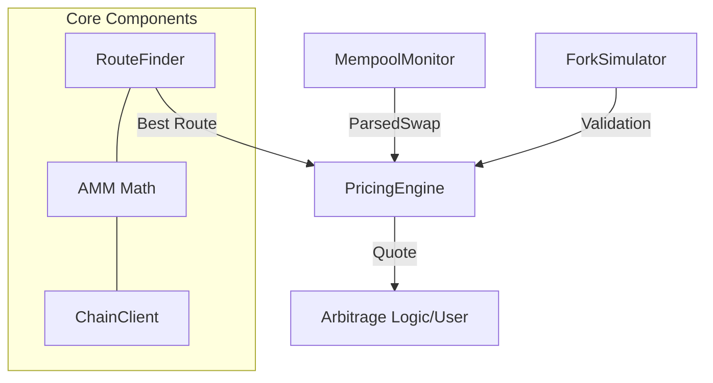
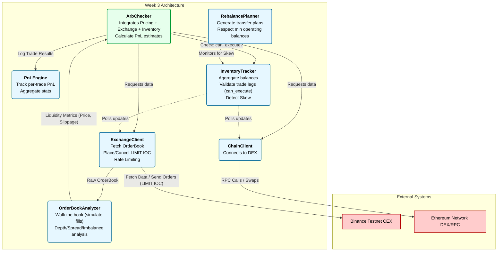

# Week 1: Arbit

This project serves as the foundation for an arbitrage trading system. It includes core modules for secure wallet
management, robust blockchain interaction, transaction construction, and analysis.

## Project Structure

- **`core/`**: Base logic and types.
    - `wallet.py`: Secure private key management and signing.
    - `types.py`: Strongly typed `Address` and `TokenAmount` with validation.
    - `serializer.py`: Deterministic JSON serialization (canonical) for signing.
- **`chain/`**: Blockchain interaction.
    - `client.py`: RPC client with automatic retries, exponential backoff, and provider switching.
    - `builder.py`: Fluent API for constructing and signing transactions.
    - `analyzer.py`: Tool for dissecting and decoding transaction data.
- **`pricing/`**: Market analysis and simulation.
    - `amm.py`: Constant Product Market Maker (Uniswap V2) math and Price Impact analysis.
    - `routing.py`: Multi-hop route discovery and net-output optimization (including gas costs).
    - `mempool.py`: Real-time monitoring of pending swaps via WebSockets.
    - `simulation.py`: Transaction simulation using local Ethereum forks (Anvil).
    - `engine.py`: High-level orchestrator integrating routing, simulation, and monitoring.
- **`scripts/`**: Utility scripts and tools.
    - `analyze_impact.py`: CLI tool to visualize price impact for different trade sizes.
    - `integration_test.py`: End-to-end test on Sepolia network.
    - `start_fork.sh`: Script to launch a local Anvil fork for testing.
- **`strategy/`**: The strategy layer is responsible for identifying, validating, and prioritizing arbitrage
  opportunities.
    - `signal.py`: Automatically detects price discrepancies between CEX and DEX. It determines the optimal trade
      direction (BUY_CEX_SELL_DEX or BUY_DEX_SELL_CEX) and enforces strict validation rules, including Signal TTL (
      Time-To-Live) and real-time inventory availability checks.
    - `fees.py`: Calculates the precise breakeven spread by aggregating CEX taker fees, DEX swap fees, and estimated
      L1/L2 gas costs. This ensures the system only targets signals with positive net expectancy.
    - `scorer.py`:Implements a multi-factor scoring algorithm (0-100). The score is derived from weighted metrics:
- **`exchange/`**: Integration with Centralized Exchanges (Binance).
    - `client.py` for CCXT-based API calls
    - `orderbook.py` for depth analysis.
- **`executor/`**: The execution layer manages the lifecycle of arbitrage trades across distributed venues.
    - `engine.py`:Handles complex trade transitions to ensure atomicity. Stages include:
      VALIDATING ➔ LEG1_PENDING ➔ LEG1_FILLED ➔ LEG2_PENDING ➔ DONE.
    - `recovery.py`:To protect capital during high volatility or infrastructure instability:
- **`integration/`**: High-level scripts for cross-platform strategies.
    - `arb_checker.py` handles arbitrage window discovery between DEX and CEX.
- **`inventory/`**: Asset and profit monitoring.
    - `tracker.py` for balances, `pnl.py` for profit calculation, and `rebalancer.py` for wallet transfer planning.
- **`tests/`**: Unit tests ensuring correctness of core components.
- **`src/`**: Source code (application logic).
- **`configs/`**: Configuration files.
- **`docs/`**: Documentation.
- **`Makefile`**: Entry point for build, test, and run commands.

## Prerequisites

- Python 3.10+
- GNU Make
- Git
- Anvil (part of Foundry) for local fork simulations.

## Installation & Setup

1. Clone the repository:
    - `git clone <repository_url>`
    - `cd trading-bot`

2. Create and activate a virtual environment:
    - `python3 -m venv .venv`
    - `source .venv/bin/activate`

3. Install dependencies:
    - `make install`

4. Install pre-commit hooks (required for development):
    - `pre-commit install`

## Configuration (Secrets Management)

1. Create a local environment file based on the template:
    - `cp .env.example .env`

2. Open .env and populate the variables:
    - ENV_TYPE=local
    - PRIVATE_KEY=<your_private_key>
    - SEPOLIA_RPC_URL=https://ethereum-sepolia-rpc.publicnode.com
    - ALCHEMY_RPC_URL=https://eth-mainnet.g.alchemy.com/v2/YOUR_KEY_ALCHEMY
    - BINANCE_TESTNET_API_KEY=YOUR_KEY
    - BINANCE_TESTNET_SECRET=YOUR_SECRET_KEY
    - BINANCE_API_KEY_PROD=
    - BINANCE_SECRET_KEY_PROD=
    - TELEGRAM_BOT_TOKEN=
    - TELEGRAM_CHAT_ID=

Note: The .env file must never be committed to the repository.

## Usage

### Running the Application

Before running arb_bot for ARB/USDC you have to fill .env with your data for binance production and also telegram-bot

- make run_arb_bot

To verify the system works on a real network (Sepolia Testnet), run the integration script. This script checks balances,
builds a self-transfer transaction, signs it, and sends it to the network:

- make run


### Expected Output:

Wallet: 0x74be7c8667F6E23e2845E6bE8A093EbFacEa4476  
Balance: 0.069784996739676 ETH

Building transaction...  
To: 0x74be7c8667F6E23e2845E6bE8A093EbFacEa4476  
Value: 0.0001 ETH  
Gas Limit: 25200  
Max Fee: 1.12 gwei

Signing and Sending...  
Signer: 0x74be7c8667F6E23e2845E6bE8A093EbFacEa4476  
Recovered: 0x74be7c8667F6E23e2845E6bE8A093EbFacEa4476  
Signature valid: Yes

Sending...  
TX Hash: 8f819485faad381a730fabf54efb75742ea7ee56a58e5d302969541b7478187d

Waiting for confirmation...  
Block: 10104759  
Status: SUCCESS  
Gas Used: 21000  
Fee: 0.000021989821035 ETH

Integration test PASSED

### Transaction Analyzer CLI

Analyze any transaction on the Ethereum mainnet (or other chains via RPC config). This tool decodes input data,
calculates fees, and summarizes transfers:

`python -m chain.analyzer <TX_HASH> --rpc ...` (https://ethereum-sepolia.publicnode.com - для тестнових
транзакцій) (https://rpc.flashbots.net - для реальних транзакцій)

### Testing

To run the test suite (pytest):

- `make test`

This includes:

- Unit tests for invariant checking.
- Negative tests for error handling.

### Development Standards

__Code Quality__

The project uses the following tools to enforce code quality:

- Formatter: Black
- Linter: Flake8

To run formatters and linters manually:

- `make format`
- `make lint`

### Pre-commit Hooks

Pre-commit hooks are configured to automatically check code style and formatting before every commit.
If a hook fails, the commit is blocked until the issues are resolved.

### Final Verification

Before submitting or pushing changes, run the full check suite:
make check

This command executes formatting, linting, and testing in sequence.

### Key Features & Design Decisions

- __Safety First__: The **`WalletManager`** ensures private keys are never exposed in **`__repr__`** or logs.
- __Reliability__: The **`ChainClient`** implements retry logic with exponential backoff to handle RPC instability (
  errors like "Too Many Requests" or "Timeout").
- __Precision__: **`TokenAmount`** handles decimals precisely, preventing floating-point errors common in financial
  software.
- __Usability__: The **`TransactionBuilder`** uses a Fluent Interface pattern, making transaction construction readable
  and less error-prone.

## Week 2: AMM & Pricing Module

This update introduces a sophisticated pricing engine that calculates optimal swap routes, predicts price impact, and
validates results via local blockchain simulation.

### Price Impact Analyzer CLI

Visualize how trade size affects the execution price in a specific pool:

`python scripts/analyze_impact.py` - will run a script with a default settings  
`python scripts/analyze_impact.py --token-in USDC --sizes 1000,5000,10000`

__Example__

```
(.venv) danylo@DesktopDanylo:~/Projects/trading-bot$ python scripts/analyze_impact.py --token-in ETH --sizes "1, 10, 50, 100"
Fetching pool data... (Using Mock for Demo)

Price Impact Analysis for ETH -> USDC
Pool: 0xB4e16d0168e52d35CaCD2c6185b44281Ec28C9Dc
Reserves: 1000 ETH / 2000000 USDC
Spot Price: 2000.0000 USDC/ETH

─────────────────────────────────────────────────────────────────
    ETH      |     USDC     |  Exec Price  |   Impact  
─────────────────────────────────────────────────────────────────
    1.00     |  1,992.0140  | 1,992.013962 |   0.40%   
   10.00     | 19,743.1607  | 1,974.316069 |   1.28%   
   50.00     | 94,965.9475  | 1,899.318950 |   5.03%   
   100.00    | 181,322.1788 | 1,813.221788 |   9.34%   
─────────────────────────────────────────────────────────────────

Calculating max trade for 1% impact...
Max trade for 1% impact: 7.09 ETH
 ```

### Running a Local Fork

Start a local simulation environment forked from Sepolia or Mainnet:

`make run_fork`

### System Architecture



### Key Features & Design Decisions

- __Fixed-Point Precision__: Implemented integer-only math for AMM calculations to ensure exact parity with Solidity
  smart contracts and prevent floating-point inaccuracies.

- __Optimal Routing__: Developed a pathfinding algorithm that maximizes net output by evaluating multi-hop routes and
  accounting for hop-specific gas overhead.

- __Pre-Trade Simulation__: Integrated a local fork environment (Anvil) to validate calculated quotes against actual
  state transitions before execution.

- __Mempool Awareness__: Established a WebSocket-based monitor to detect pending swaps, enabling the system to estimate
  real-time slippage and identify arbitrage opportunities.

- __Modular Architecture__: Isolated pricing logic, routing, and simulations into distinct modules, coordinated by a
  central PricingEngine for high-level integration.

- __Gas-Aware Optimization__: Logic dynamically switches between direct and multi-hop routes based on current network
  gas prices to ensure profitability.

## Week 3: CEX Integration & Inventory Management

This phase of the project focuses on Centralized Exchange (Binance) integration, real-time asset tracking, and financial
performance reporting.

### Submission Commands

* **Order Book Analysis (Part 2)**:
    ```bash
    python scripts/orderbook_analyzer.py ETH/USDT --depth 20
    ```
* **Rebalancing (Part 4)**:
    * Check if rebalancing is required:
        ```bash
        python scripts/rebalance_cli.py --check
        ```
    * Preview rebalancing plan for a specific token (e.g., ETH):
        ```bash
        python scripts/rebalance_cli.py --plan ETH
        ```
* **PnL Engine (Part 5)**:
    * Generate summary report:
        ```bash
        python scripts/pnl_engine.py --summary
        ```
    * Analyze and export report to CSV:
        ```bash
        python scripts/pnl_engine.py --summary --export report.csv
        ```
* **Integration Demo Script (Part 6)**:
    ```bash
    python -m integration.arb_checker ETH/USDT --size 2.0
    ```
* **LIMIT IOC Demonstration**:
    ```bash
    python scripts/test_limit_ioc.py
    ```

### Extra Tasks Demonstration

* **Real-time Inventory Dashboard (Terminal UI)**:
    ```bash
    python scripts/dashboard.py
    ```
* **Historical PnL Chart Export**:
  Generate dummy data first, then plot the chart:
    ```bash
    python scripts/generate_dummy_data.py
    python -m scripts.plot_pnl trades.csv
    ```
* **Arb Opportunity Logger**:
  Automatically triggered during **Part 6** execution. All discovered opportunities are logged to `opportunities.csv`
  for further analysis.

### System Architecture



## Key Features & Design Decisions

* **Unified Inventory**: Provides a seamless interface to track assets across CEX (via Binance API) and DEX (via
  On-chain calls) simultaneously.
* **PnL Precision**: High-accuracy profit calculation factoring in trading fees from both platforms and real-time
  network Gas costs.
* **IOC Orders**: Implementation of "Immediate-Or-Cancel" logic for limit orders to mitigate the risk of partially
  filled positions during arbitrage cycles.
* **Extensible Architecture**: Modular design allowing for easy integration of additional exchanges or AMM types without
  modifying core strategy logic.

## Week 4: Strategy & Execution

This update introduces the "Brain and Muscles" of the arbitrage system, focusing on intelligent opportunity detection
and robust multi-venue execution.

### Submission Commands

## Submission Commands

* **Verify Execution Logic:**  
  Run the standalone verification script to test state transitions and safety guards:
    ```
    python scripts/verify_executor.py
    ```
* **Make Price Anomalies**  
    Simulate market movements to trigger the bot. In a separate terminal (with the fork running), manipulate the DEX price:
    ```
    # To simulate a DEX price drop
    python scripts/manipulate_price.py dump --amount 5000

    # To simulate a DEX price pump
    python scripts/manipulate_price.py pump --amount 5000
  ```
* **Run bot and check for its out put**
    ```
  python scripts/arb_bot.py
  ```

## Key Features & Design Decisions

* **Intelligent Scoring**: Multi-factor scoring engine that prioritizes opportunities based on spread, liquidity depth, and inventory balance.
* **Execution State Machine**: Manages the complex lifecycle of arbitrage trades across distributed venues to ensure consistency and atomicity.
* **Adaptive Safety (Circuit Breaker)**: Automated system protection that halts the bot after 3 consecutive failures within a 5-minute window.
* **Discord Notifications**: Instant alerting system via Webhooks to notify about Circuit Breaker trips, critical errors, or successful high-PnL trades.
* **Flashbots Integration**: Specialized DEX-first execution path to minimize gas costs and mitigate the risk of failed on-chain transactions.


## Final Production Run & Risk Management

During the final production phase, the bot was deployed to the **Arbitrum One (L2)** network targeting the **ETH/USDC** and **ARB/USDC** pairs between **Uniswap V2** and **Binance**.

### Safety & Risk Controls
Absolute strict limits are hardcoded via `safety.py` to prevent any catastrophic drain of funds:
- **`ABSOLUTE_MAX_TRADE_USD`**: $25.0
- **`ABSOLUTE_MAX_DAILY_LOSS`**: $20.0 (Preserves 80% of $100 starting capital)
- **`ABSOLUTE_MIN_CAPITAL`**: $50.0 (Auto-stop threshold)
- **`ABSOLUTE_MAX_TRADES_PER_HOUR`**: 30
- **Manual Kill Switch**: Implemented and successfully tested (bot halts execution within one loop cycle upon detecting the trigger file).
- **Circuit Breaker**: Active to monitor infrastructure instability.

### Production Results
- **Initial Capital**: $100.00
- **Ending Capital**: $100.00
- **Total Trades Executed**: 0
- **Total PnL**: $0.00

**Analysis**: 
The bot correctly preserved 100% of the capital. With a starting bankroll of $100 and a max trade size of $25, the required spread to overcome L2 gas fees (EIP-1559 differences from Mainnet) and exchange routing fees is significantly higher than market averages. The safety logic worked as intended, correctly rejecting trades that did not have a positive net expectancy after all costs were calculated.

### Checklist of Fulfilled Requirements
- [x] **Production config**: Connected to Arbitrum L2 + Binance Production.
- [x] **Safety constants**: Hardcoded absolute limits (`safety.py`).
- [x] **Kill switch**: File-based kill switch implemented and tested.
- [x] **Risk limits**: `max_trade_usd` and `max_daily_loss` integrated.
- [x] **Pre-trade validation**: Spread sanity, expiration, and fee coverage checks.
- [x] **Logging & Journaling**: Trade state logs output to `/logs` and daily journals maintained.
- [x] **Capital Preservation**: 100% of capital preserved under strict risk checks.